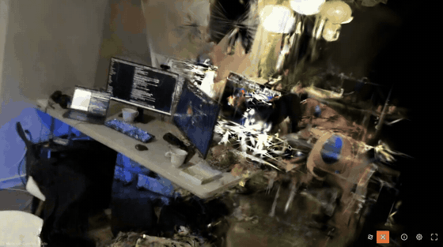
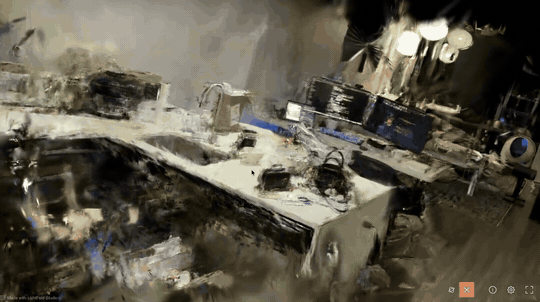

# WeddingAI

**Stanford × DeepMind Hackathon — solo submission**

**Live demo:** https://wedding-ai-omega.vercel.app

Walk into your wedding before it exists. WeddingAI takes a video walkthrough of
an empty venue, uses **Google Gemini** to design a wedding theme from that
specific room and to render the room restyled in that theme, and builds toward a
3D scene you can move through.



*A real 3D Gaussian Splatting reconstruction — 1.5M splats, built from a
42-second handheld phone video and trained on a rented RTX 5090 (details in
"Honest status" below). This is what the pipeline produces when run manually,
not something the deployed app generates today — the deployed app still hands
back a placeholder scene while the video→3D hop gets wired in.*

---

## Product overview

You film a slow 60-second orbit of an empty venue on your phone. WeddingAI:

1. **Turns the video into an evenly spaced photo set** in your browser — no
   manual photography, no huge upload.
2. **Designs a wedding theme from your actual room** with Gemini, returning a
   structured design report: palette with real hex values, decor, florals,
   styling notes, and an assessment of whether your footage is good enough to
   reconstruct in 3D.
3. **Renders your venue restyled in that theme** with Gemini's image model —
   your room, not a stock photo.
4. **Runs the scene through a 3D reconstruction pipeline** so it becomes a space
   you can walk through. *(See "Honest status" — this stage runs in mock mode in
   the deployed app today.)*

## Problem

Couples commit tens of thousands to a venue after touring an **empty room**. The
gap between "beige function hall on a Tuesday afternoon" and "our wedding" is
enormous, and nothing bridges it:

- **Venue tours** show the space unstyled, empty, under fluorescent light.
- **Mood boards and Pinterest** show *other people's* weddings in *other
  people's* venues.
- **Professional visualisation** exists, but costs more than most couples' whole
  decor budget and takes weeks.

So the most expensive decision of the entire event gets made largely on
imagination — and the anxiety of "will this actually look like anything?" runs
right up to the day itself.

**Target user:** engaged couples choosing or styling a venue, plus the wedding
planners and venue sales teams who have to sell a vision of an empty room.

## Solution

WeddingAI closes that gap using the two things a couple already has: a phone,
and a venue they can stand in.

Point the camera and walk. From that one video, Gemini produces a coherent
design for *your* room and then shows you the room wearing it. Because the
design is derived from the actual space — its light, its architecture, its
existing colours — the result is specific rather than generic.

The capture step matters as much as the AI. 3D reconstruction needs 40–150
overlapping photos of one place, which nobody will shoot by hand. A 45–90 second
video gives the same coverage in one take, and WeddingAI extracts the frames
automatically.

## Gemini integration

Gemini is the product, not a garnish. Two server-side capabilities:

### 1. Theme design — structured output
**`frontend/app/api/analyze/route.ts`** · model `gemini-3.5-flash`

Sends up to 8 evenly sampled, downscaled venue photos and receives a
**schema-constrained JSON** `ThemeReport`:

| Field | Purpose |
|---|---|
| `theme_name`, `one_liner`, `description` | the design concept |
| `color_palette[]` | 5 named colours with real hex values, rendered as swatches |
| `decor[]`, `florals[]` | concrete styling recommendations |
| `venue_observations` | what Gemini actually noticed in *your* room |
| `photo_coverage` | `good` / `usable` / `poor` + advice — Gemini judging whether the footage can reconstruct in 3D |
| `tags[]` | styling keywords |

The response is validated before rendering; a malformed response is a handled
error, not a crash.

### 2. Venue restyling — image to image
**`frontend/app/api/render/route.ts`** · model `gemini-2.5-flash-image`

Takes a real photo of the venue plus the chosen theme and generates a
photorealistic render of **that room** styled for the wedding. Used on the
upload screen ("Visualize theme") and throughout the Studio screen, which
restyles a whole set of frames in sequence with per-image progress and error
handling.

### Security and reliability

- **The API key never reaches the browser.** Both calls are Next.js server-side
  route handlers; `GEMINI_API_KEY` is read server-side only and never appears in
  any client bundle.
- **Errors are mapped, not leaked:** `400` missing/invalid input, `502` Gemini
  failure or malformed response, `504` timeout (50s cap, `maxDuration=60`). No
  stack traces and no key material appear in any response.
- **Input is bounded:** at most 8 photos, downscaled to ~1024px JPEG before
  sending, keeping latency and cost predictable.
- **Repeat calls are avoided:** theme reports are cached in `localStorage`
  against a fingerprint of the photo set, so re-selecting the same photos
  resolves instantly instead of re-billing Gemini.
- **Progress is always visible**, and in-flight responses are guarded by a
  request-generation ref so a slow reply can never paint over a newer one.
- **Gemini's role is disclosed in the UI**, next to the features it powers.

## Architecture

```
                    ┌───────────────────────────────────────────┐
  phone video  ──►  │  Browser                                  │
                    │  <video>+<canvas> → ~110 JPEG frames      │
                    │  (lib/frames.ts)  → JSZip                 │
                    └───────┬───────────────────────┬───────────┘
                            │                       │
              downscaled ≤8 │                       │ frames.zip
                            ▼                       ▼
              ┌─────────────────────────┐   ┌──────────────────────┐
              │ Next.js route handlers  │   │  Axum backend        │
              │  /api/analyze  (Gemini) │   │  (Rust) on Railway   │
              │  /api/render   (Gemini) │   │  jobs + state machine│
              │  SERVER-SIDE ONLY       │   │  Postgres            │
              └─────────────────────────┘   └──────┬───────────────┘
                                                   │
                                            ┌──────▼───────────────┐
                                            │ Worker               │
                                            │ mock poller (default)│
                                            │ or RunPod GPU:       │
                                            │ COLMAP → LichtFeld   │
                                            └──────────────────────┘
```

**Job state machine:** `uploaded → queued → sfm → training → exporting → done`,
with `failed` reachable from any state.

**Mock vs real is decided in exactly one place** — `AppState::new` in
`backend/src/state.rs` selects `WorkerClient::Mock` or `WorkerClient::Runpod`
from `MOCK_MODE`.



*Output of the `COLMAP → LichtFeld` path above, run manually on a rented GPU —
see "Honest status" for the exact numbers and for what the deployed app
actually does today.*

| Path | Owns |
|---|---|
| `frontend/app/api/analyze`, `api/render` | the two Gemini capabilities (server-side) |
| `frontend/lib/frames.ts` | video → evenly spaced frames, in-browser |
| `frontend/lib/theme.ts` | downscaling, Gemini calls, caching |
| `backend/src/routes.rs` | HTTP endpoints |
| `backend/src/db.rs` | job model + every SQL statement |
| `backend/src/poller.rs` | advances active jobs |
| `worker/handler.py` | GPU pipeline (blueprint) |
| `scripts/video-to-frames.sh` | ffmpeg frame extraction for local/GPU runs |

## Honest status

So judges know exactly what they are looking at:

- ✅ **Gemini theme design is live**, running against real uploaded photos.
- ⚠️ **Gemini venue restyling is implemented but currently blocked on quota.**
  The route (`/api/render`, `gemini-2.5-flash-image`) is complete and correct —
  server-side, schema-validated theme in, rendered image out — but the API
  key's Cloud project has no billed quota for image generation
  (`generate_content_free_tier_requests`, `limit: 0`), so calls currently
  return a mapped `502`. This is a billing/project configuration issue, not a
  code issue.
- ✅ **Video → frame extraction is live**, in-browser.
- ✅ **Backend, job state machine and Postgres are live** and survive redeploys.
- ⚠️ **3D reconstruction runs in mock mode in the deployed app.** Jobs walk the
  real state machine on real timings and return a **placeholder scene** —
  today, uploading a video in the live app does *not* produce the
  reconstruction described below.
- ⚠️ **A real reconstruction exists, but it was produced manually, offline —
  not by the deployed app.** From a 42-second handheld phone video (best ~7s
  used, sampled at 20 fps → 140 frames): COLMAP registered 140/140 images
  (100%) into a single model, 17,312 points, 0.89 px mean reprojection error,
  ~2,869 keypoints/image. LichtFeld Studio then trained 1,514,776 splats in
  3m53s on a rented RTX 5090 (held-out eval: PSNR 25.29, SSIM 0.874), exported
  to a 30.7 MB self-contained `scene.html` with working orbit/zoom (the GIFs
  above are recordings of it). This proves the pipeline end to end; it is not
  yet wired into the web app's job flow.

The Gemini theme-design capability this hackathon requires is fully real and
live. Venue restyling and 3D reconstruction are real, working implementations
gated on quota and integration work respectively — both labelled honestly
above rather than implied.

## Local setup

Requires Rust, Node 22+, and Docker (for Postgres).

```bash
git clone https://github.com/jamesEmerson112/WeddingAI.git
cd WeddingAI

# Backend — Postgres must be running first
cd backend
cp .env.example .env
docker compose up -d          # Postgres on :5432
cargo run                     # :8080, migrations run automatically

# Frontend — in a second terminal
cd frontend
cp .env.example .env          # then add your GEMINI_API_KEY
npm install
npm run dev                   # :3000
```

Open http://localhost:3000. Mock mode is the default, so no GPU or cloud
credentials are needed — a job reaches `done` in about 25 seconds.

Check the backend with `curl -s localhost:8080/api/health`, which reports
process, database and config state in one request.

```bash
# Tests and lints (CI enforces all of these)
cd backend  && cargo fmt --check && cargo clippy -- -D warnings && cargo test
cd frontend && npm run lint && npm run build
```

## Environment variables

Names only — no values are committed anywhere, and `.env*` is gitignored.

**`frontend/.env`**

| Variable | Purpose |
|---|---|
| `GEMINI_API_KEY` | Gemini Developer API key. **Server-side only** — read exclusively in route handlers, never exposed to the browser. |
| `NEXT_PUBLIC_API_URL` | Backend base URL. Baked in at build time. |

**`backend/.env`**

| Variable | Purpose |
|---|---|
| `MOCK_MODE` | `true` = simulated pipeline (default). Anything but `false` keeps it on. |
| `PORT` | Listen port (default 8080). |
| `PUBLIC_BASE_URL` | Public URL of the backend; falls back to Railway's injected domain, then localhost. |
| `DATABASE_URL` | Postgres connection string. On Railway, set to `${{Postgres.DATABASE_URL}}`. |
| `TEST_DATABASE_URL` | Used only by `cargo test`. |
| `RUNPOD_API_KEY`, `RUNPOD_ENDPOINT_ID` | Real GPU mode only. |
| `R2_*` | Object storage for artifacts; real mode only. |

## Deployment

| Component | Platform | Notes |
|---|---|---|
| Frontend | **Vercel** | https://wedding-ai-omega.vercel.app — auto-deploys on push to `main`. Gemini route handlers run server-side here. |
| Backend | **Railway** | https://weddingai-production.up.railway.app — auto-deploys on push via `backend/Dockerfile`. |
| Database | **Railway Postgres** | Persists across deploys. |
| GPU worker | **RunPod** | On demand; not required for the demo. |

CI (`.github/workflows/ci.yml`) runs `cargo fmt --check`, `cargo clippy -D
warnings`, `cargo test` (against a Postgres service container) and the frontend
production build on every push and PR.

## Demo link

**https://wedding-ai-omega.vercel.app** — no login, no credentials required.

Suggested 60-second path:

1. **Create a memory** — drop in venue photos, or a short walkthrough video and
   watch the frames get extracted in the browser.
2. **Pick a preset theme**, or press **"Or let Gemini design from my photos"** to
   trigger the live structured-output call — palette, decor, florals and a
   coverage verdict derived from your actual room.
3. **"Visualize theme"** to have Gemini render your venue restyled — *currently
   blocked on API quota and returns a 502; see "Honest status" above. Skip this
   step in a live demo.*
4. **Create memory** → watch the job walk the pipeline → open the viewer.
5. **"✦ Reimagine in Studio"** to restyle the whole set in a new mood — *same
   `/api/render` call as step 3, so it hits the same quota block; see "Honest
   status."*

## Credits & license

Built on the MIT-licensed [splat-service](https://github.com/jamesEmerson112/splat-service)
boilerplate.

3D reconstruction runs on [LichtFeld Studio](https://github.com/MrNeRF/LichtFeld-Studio)
(GPL-3.0), invoked as an external process only — this repo does not link
against or redistribute its code, so WeddingAI itself remains MIT (see
[LICENSE](LICENSE)). Citation, per the upstream project's request:

```bibtex
@software{lichtfeld2025,
  author    = {LichtFeld Studio},
  title     = {LichtFeld Studio},
  year      = {2025},
  url       = {https://github.com/MrNeRF/LichtFeld-Studio}
}
```
